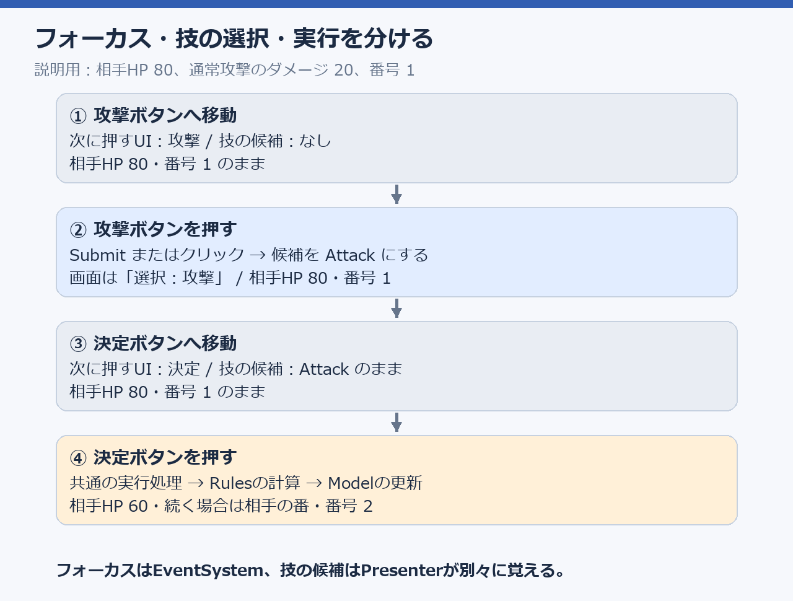
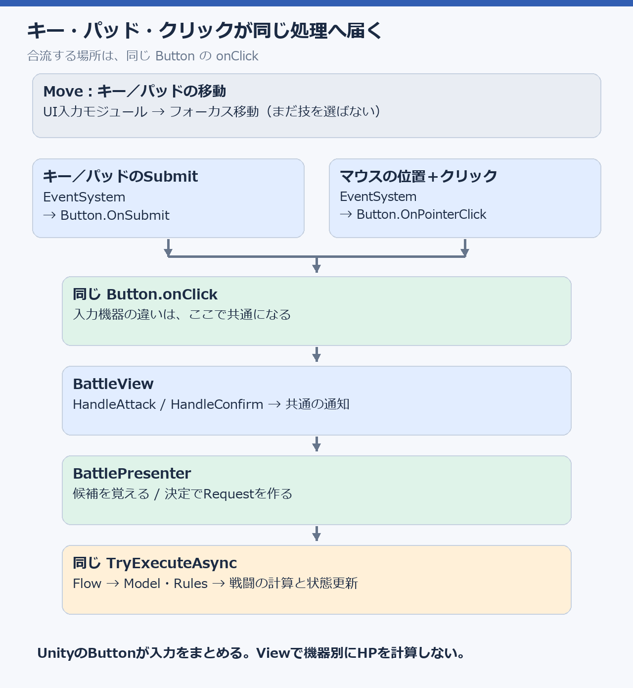
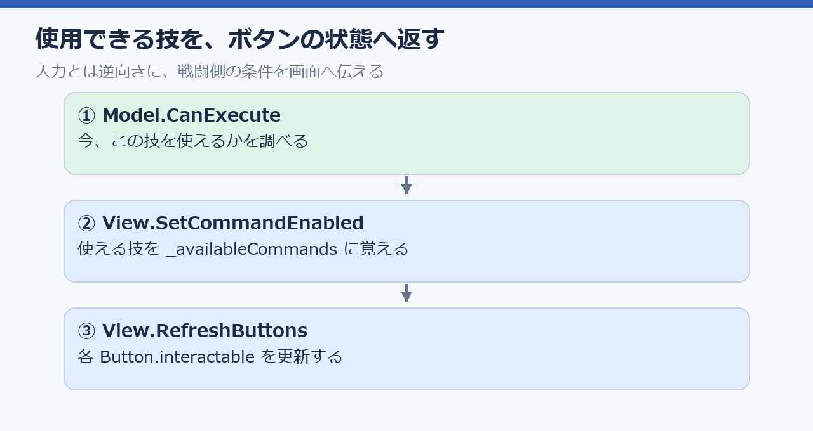
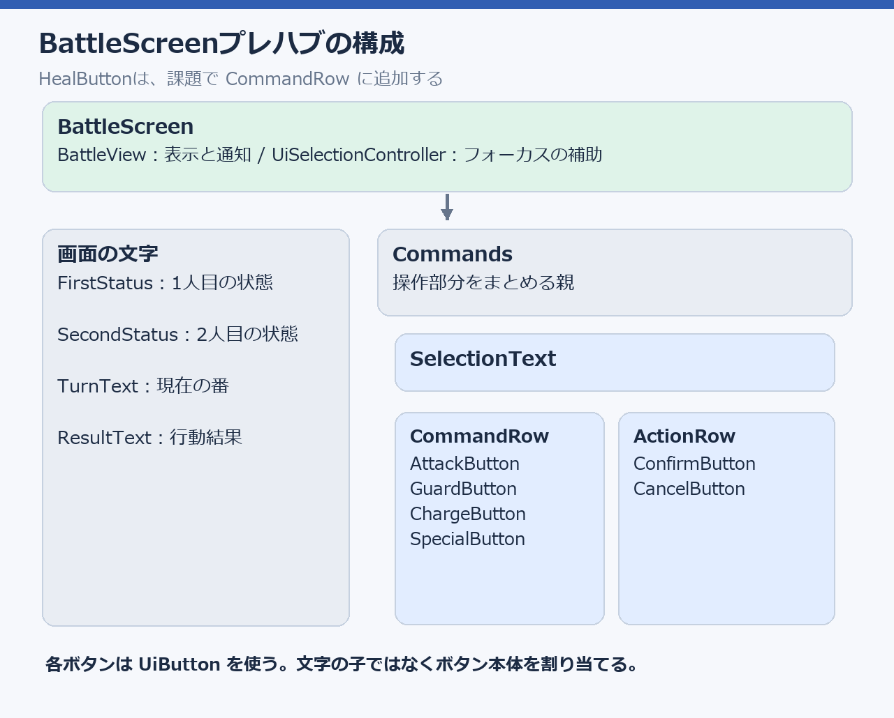
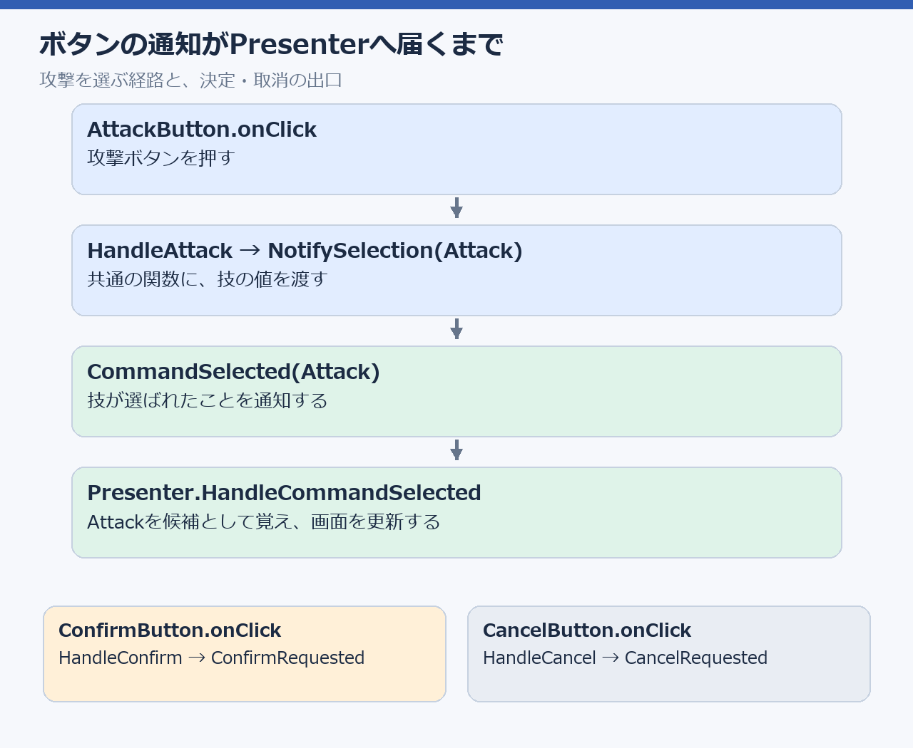
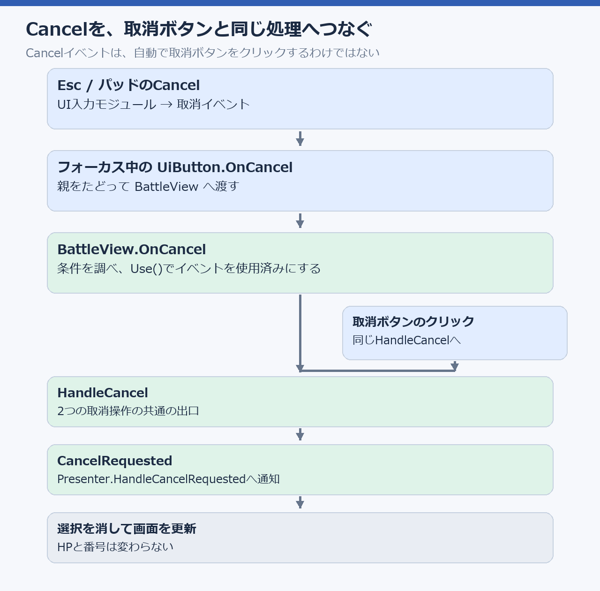
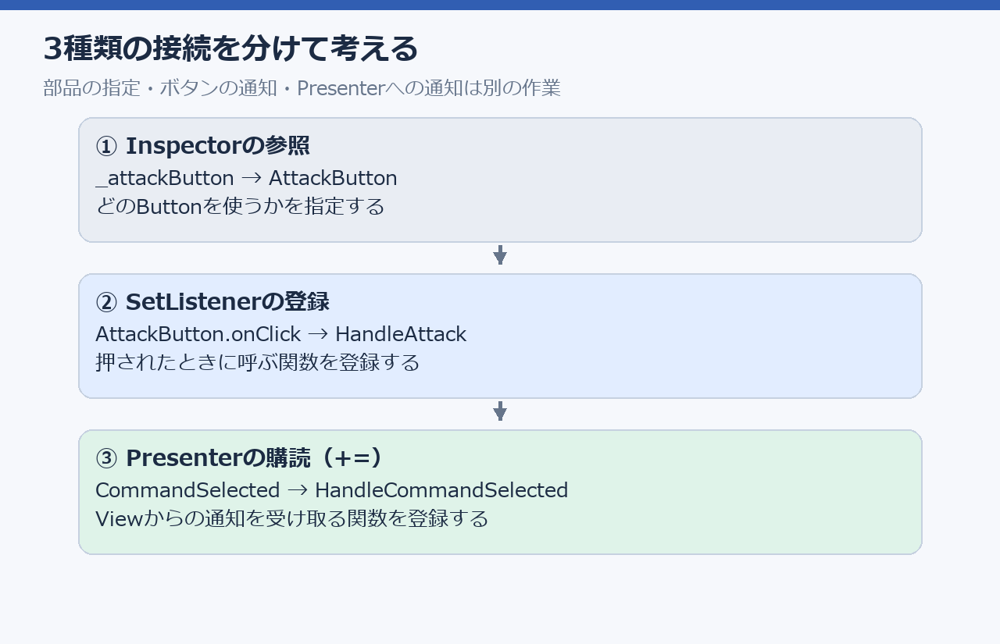

# 第2回：選択・決定・取消と入力の接続

## 今日の目標：操作する道具が違っても、同じ戦闘処理へ届くようにする

同じ「攻撃」でも、パッドならボタンを押し、キーボードならEnterを押し、マウスなら画面のボタンをクリックします。入力される情報は違いますが、ゲームが受け取りたい指示は同じです。

今日は、この違いをUIの入口でまとめて、どの操作でも「攻撃を選ぶ」「決定する」「取り消す」を同じ関数へ渡せるようにします。入力機器ごとにHPを減らす処理を作ると、ルールを変えるたびに複数のコードを直すことになるためです。

授業の終わりには、次のつながりをコードと画面の両方で説明できることを目指します。

- キー／パッドのSubmitとクリックは、どちらも同じボタンのonClickへ入る。
- ボタンを押した通知はBattleViewからBattlePresenterへ届く。
- 技を選んだ段階ではHPは変わらず、決定したときに第1回の戦闘処理へ進む。
- 回復ボタンを同じ入口につなげば、決定・取消や戦闘処理を作り直さずに使える。

### まず、攻撃を1回する操作を比べる

配布版のUI入力では、キーの矢印／WASD、パッドの十字キー／スティックが移動、Enterとパッドの下側のボタンがSubmitです。パッドの表記は機種で異なります。取消はEscまたはパッドの右側のボタンに割り当てられています。

- キーボード：攻撃ボタンへ移動 → Enterで攻撃を選ぶ → 決定ボタンへ移動 → Enterで実行する。
- パッド：攻撃ボタンへ移動 → Submitで攻撃を選ぶ → 決定ボタンへ移動 → Submitで実行する。
- マウス：攻撃ボタンをクリックして選ぶ → 決定ボタンをクリックして実行する。

EnterやパッドのSubmitは「今フォーカスしているボタンを押す操作」です。攻撃ボタン上なら技を選び、決定ボタン上なら実行します。Submitだけで必ず攻撃するわけではありません。

### 「フォーカス」「技の選択」「実行」を分ける

例として、自分のHPが100、相手のHPが80、現在の番号が1の状態を考えます。通常攻撃のダメージが20なら、操作の途中では次のようになります。この数値は説明用で、実際にはマスタの値を使います。



フォーカスはEventSystemが覚える「次に押すUI」、選択中の技はPresenterが覚える「実行する候補」です。決定へ移動しただけでAttackが消えたら、決定ボタンで実行できません。このため、2つを別々に覚えます。

②の後に取消した場合は、選択がなしへ戻るだけです。相手のHPは80、番号は1のままです。まだ実行していないので、HPを戻す処理もありません。

### 入力が共通になる場所



Button.OnSubmitとButton.OnPointerClickはUnityのボタン側が用意している処理です。どちらもボタンを押すとonClickへ入るため、BattleViewでは入力機器を調べる必要がありません。EventSystemは入力を届ける相手のUIを管理し、InputSystemUIInputModuleはInputActionの入力をUI向けのイベントに変換します。

### 今日、自分が書く場所と配布済みの場所

- 配布済み：InputAction、EventSystem、InputSystemUIInputModule、UiButton、UiSelectionController。機器からボタンまでの入口を担当します。
- 一緒に実装する：BattlePresenterの入力受付・選択・決定・取消と、BattleViewの通知。ボタンから戦闘の指示までを担当します。
- 演習で広げる：第1回の回復を、同じボタン通知へ接続します。

入口が配布済みでも、Viewの通知やPresenterの受付が空なら戦闘処理へ届きません。今日は、この途中のつながりを完成させます。

## どの順番で実装するか

最初に、入力が届いた後の「選ぶ・決定する・取り消す」をPresenterに作ります。次に、プレハブのどの部品を使うかを見て、ボタンの通知をそのPresenterへつなぎます。最後に、攻撃と同じ仕組みで回復を接続します。

逆向きに全部のクラスを読んで覚える必要はありません。「このボタンを押すと、この通知が届き、この値が変わる」という1本の流れを追います。

## 編集するファイル

パスは `Assets/TurnForge/Scripts/` からの場所です。

| ファイル | 実装する内容 |
|---|---|
| `UI/Battle/BattlePresenter.cs` | 入力受付、技の選択・決定・取消、使える技の表示 |
| `UI/Battle/BattleView.cs` | ボタン操作を共通のイベントへ接続 |

第1回で作った `BattleRules` と `BattleModel` を使います。InputActionの作成方法は前期に扱ったため、今回は配布済みのUI入力を戦闘の指示へ接続します。

操作はどの方式でも「技を選ぶ → 決定する」です。技ボタンへのフォーカス移動と、戦闘で使う技の選択を区別します。クリックでも、技を選んだ後に決定ボタンを押します。

## 1コマ目：Presenterで選択・決定・取消を作る

### CanAcceptPlayerInput（LESSON02-01）

#### なぜ入力を受け付ける条件が必要か

CPUの番に決定を押したり、攻撃処理中に何度も押したりしても、行動を増やさないようにします。「ボタンが押された」と「その指示を今受け付けてよい」は別の話です。

このプロパティは、その場で処理せず、受け付けてよいかをboolで返す入口です。選択・決定・取消の各関数が同じ条件を使います。条件を各関数へ別々に書くと、一部だけCPUの番でも操作できる、といった食い違いが起きます。

`_inputSide` はこのPresenterが受け持つ側、`CurrentState.ActionSide` は今行動する側です。両者が一致するかを比べます。`&&` はすべての条件を満たす指定で、途中がfalseなら後の条件は評価されません。初期化やnullの条件を先に置くことで、使えない相手の値を読まずに止められます。

この関数が決めるのは受付の可否だけです。HP・番・選択中の技は変更しません。

次の条件をすべて満たすときだけ、プレイヤーの操作を受け付けます。

- 初期化が終わっている。
- 破棄されていない。
- 行動・演出の処理中ではない。
- `BattleFlowController` が入力を受け付けている。
- 現在の状態があり、バトルが続いている。
- 現在の `ActionSide` が `_inputSide` と一致する。

#### ライブコーディング

対象のメソッドまたはプロパティ全体を、次のコードへ置き換えます。

```csharp
/// <summary>プレイヤーの操作を受け付けられるか。</summary>
private bool CanAcceptPlayerInput =>
    _isInitialized && !_isDisposed && !_isExecuting
    && _view != null && _flow != null && _flow.CanAcceptInput
    && _model?.CurrentState != null
    && !_model.CurrentState.IsFinished
    && _model.CurrentState.ActionSide == _inputSide;
```

### HandleCommandSelected（LESSON02-02）

#### ボタンの操作を「実行する候補」に変える

攻撃ボタンを押した通知には`BattleCommand.Attack`が入ります。この関数は、その技を今使えるかModelへ問い合わせ、使えるときだけ候補として覚えます。

`_selectedCommand`は技を1つ覚える値です。nullableの`BattleCommand?`なので、技がない状態をnullで表せます。Viewに渡すのは、その候補を画面へ表示してもらうためです。Presenterの値が判断に使う選択、Viewの値は表示とボタンの状態に使う選択で、PresenterからViewへそろえます。

ここでTryExecuteAsyncを呼ぶと、攻撃ボタンを押した時点で戦闘が進み、決定ボタンの意味がなくなります。今回は「選択：攻撃」と表示し、HPと番号はそのままにします。別の使える技を押せば、候補だけがその技へ変わります。

- `CanAcceptPlayerInput` を調べる。
- `BattleModel.CanExecute(_inputSide, command)` で、その技を使えるか調べる。現在のターン番号はModel側で使われます。
- 使える場合は `_selectedCommand` に覚え、Viewの選択表示を更新する。

技を選んだだけでは、HPやターン番号を変えません。

#### ライブコーディング

対象のメソッド全体を、次のコードへ置き換えます。

```csharp
/// <summary>使える技を選び、表示へ反映する。</summary>
private void HandleCommandSelected(BattleCommand command)
{
    if (!CanAcceptPlayerInput || !_model.CanExecute(_inputSide, command))
    {
        return;
    }

    _selectedCommand = command;
    _view.SetSelectedCommand(_selectedCommand);
    RefreshInput();
}
```

### HandleConfirmRequested（LESSON02-03）

#### ここで初めて、戦闘を進める指示を作る

決定ボタンは、パッドで押してもマウスで押しても、この同じ関数へ届きます。入力機器の情報はもう必要なく、必要なのは「誰が・何番のターンに・どの技を使うか」です。これをBattleActionRequestにまとめます。

`HasValue`は候補があるか、`Value`はその技を取り出す指定です。HasValueを先に調べ、候補がない決定を止めます。番号はボタンや選択時の値を覚えて使うのではなく、決定した時点のCurrentStateから読みます。

選択時の判定を通っていても、実行直前の状態が同じとは限りません。Model.CanExecuteで最新の条件をもう一度調べます。使えなければ実行せず、RefreshInputで画面を現在の条件へそろえます。

TryExecuteAsyncは配布済みの共通の実行先です。`.Forget()`はUniTaskの処理をこのvoidの関数から開始する呼び方で、攻撃を3つの入力方式ごとに実装する指定ではありません。この後の実行中の受付停止やRulesへの受け渡しも、既存の同じ経路を使います。

- 操作を受け付けられ、技が選ばれているか調べる。
- 現在のターン番号を使って `BattleActionRequest` を作る。
- 実行条件をもう一度調べる。
- 配布済みの `TryExecuteAsync` へ指示を渡す。

選んだ後に状態が変わる場合があるため、決定時にも条件を調べます。入力方式ごとに攻撃処理を作らず、同じ実行先へ渡します。

#### ライブコーディング

対象のメソッド全体を、次のコードへ置き換えます。

```csharp
/// <summary>選択中の技を、現在のターンの指示として送る。</summary>
private void HandleConfirmRequested()
{
    if (!CanAcceptPlayerInput || !_selectedCommand.HasValue)
    {
        return;
    }

    // 選択後に状態が変わる場合に備え、決定時にも条件を調べる。
    BattleCommand command = _selectedCommand.Value;
    if (!_model.CanExecute(_inputSide, command))
    {
        RefreshInput();
        return;
    }

    // 現在の番号を使い、配布済みの実行処理へ合流する。
    var request = new BattleActionRequest(
        _inputSide, _model.CurrentState.TurnNumber, command);
    TryExecuteAsync(request).Forget();
}
```

### HandleCancelRequested（LESSON02-04）

#### 取り消すのは行動ではなく、まだ実行していない候補

「選択：攻撃」が出ているところで取消すると、`_selectedCommand = null`で候補を消します。Viewにもnullを渡すと、表示は「コマンドを選択してください」へ戻ります。最後にボタンの押せる状態も更新します。

例えば相手HP80・番号1で攻撃を選び、取り消した場合、HP80・番号1はそのままです。BattleActionRequestを作らず、Rulesも呼ばないためです。実行済みの攻撃を取り消す仕組みとは別です。

パッドのCancelも、マウスで押す取消ボタンも、最終的にはここへ届きます。片方だけ別の変数を消す実装にはしません。

- 操作を受け付けられるか調べる。
- `_selectedCommand` を `null` にする。
- Viewの選択表示を消し、ボタンの状態を更新する。

取消では戦闘状態を変えません。

#### ライブコーディング

対象のメソッド全体を、次のコードへ置き換えます。

```csharp
/// <summary>技の選択を取り消す。</summary>
private void HandleCancelRequested()
{
    if (!CanAcceptPlayerInput)
    {
        return;
    }

    _selectedCommand = null;
    _view.SetSelectedCommand(null);
    RefreshInput();
}
```

### RefreshInput（LESSON02-05）

#### ゲームの条件を、ボタンの押せる状態へ戻す

戦闘の処理と画面をつなぐ向きは、入力から戦闘への一方通行ではありません。戦闘側が決めた「今操作できるか」「どの技が使えるか」を、画面へ返す必要があります。



`Enum.GetValues`はBattleCommandの値を順に取り出します。そのためHealも同じ処理で調べられます。`_availableCommands`はViewが受け取った「使える技の一覧」で、Rulesの代わりに条件を決めるものではありません。

ボタンはinteractableをfalseにすると押せない状態になります。さらにViewとPresenterの通知でも条件を調べます。見た目の状態を更新することと、届いた指示を受け付けるか判断することは、両方必要だからです。

候補が使えなくなった場合は、そのまま「選択中」と表示し続けないようにnullへ戻します。取消・行動完了・入力受付の切り替わりに合わせて、候補と画面をそろえる関数です。

- 操作全体を受け付けられるか調べる。
- 各技について `BattleModel.CanExecute(_inputSide, command)` で使用できるか調べる。
- `SetCommandEnabled` で各技のボタンへ反映する。
- 選択中の技が使えなくなった場合は、選択を解除する。
- 選択表示と `SetInputEnabled` を更新する。

第1回で実装した通常攻撃と回復を使います。防御・チャージ・必殺技は、Rulesの実装が済むまで使用不可にします。

#### ライブコーディング

対象のメソッド全体を、次のコードへ置き換えます。

```csharp
/// <summary>使える技と選択状態を、画面へ反映する。</summary>
private void RefreshInput()
{
    if (_isDisposed || !_isInitialized)
    {
        return;
    }

    // 操作全体を受け付けられるか。
    bool canAccept = CanAcceptPlayerInput;
    foreach (BattleCommand command in Enum.GetValues(typeof(BattleCommand)))
    {
        // 各技の使用条件を本体に問い合わせる。
        bool canUse = canAccept && _model.CanExecute(_inputSide, command);
        _view.SetCommandEnabled(command, canUse);
    }

    if (_selectedCommand.HasValue
        && (!canAccept || !_model.CanExecute(_inputSide, _selectedCommand.Value)))
    {
        _selectedCommand = null;
    }

    _view.SetSelectedCommand(_selectedCommand);
    _view.SetInputEnabled(canAccept);
}
```

## 2コマ目：Viewの共通通知へ3種類の操作をつなぐ

### バトル画面のプレハブを開く

Projectウィンドウで `Assets/TurnForge/Prefabs/UI/Screens/BattleScreen.prefab` をダブルクリックします。Prefab Modeで、この画面の部品を編集します。実行中の画面やMainシーンの複製ではなく、このプレハブを開きます。

現在の構成は次のとおりです。HealButtonはまだなく、3コマ目に追加します。



- BattleScreenを選ぶと、InspectorにBattleViewとUiSelectionControllerが出ます。BattleViewは表示とボタン通知、UiSelectionControllerはキー・パッドで操作するボタンのフォーカスを担当します。
- 各ボタンは共通のUiButtonプレハブを使っています。UiButtonはButtonを継承しているため、BattleViewのButton型の欄に割り当てられます。子のTMP文字を割り当てるのではありません。
- Commandsと各Rowは、表示位置や並びをまとめる親です。HP計算やターン交代は行いません。
- Inspectorの参照は「この変数で、どの部品を使うか」の指定です。関数の名前を割り当てる欄ではありません。

### ライブコーディング：攻撃・決定・取消の接続

講師と一緒に、BattleScreenのBattleViewに次のボタンを割り当てます。既に入っている参照も、Hierarchy上の同じボタンにつながっていることを見ながら説明を聞きます。

- Attack Button（_attackButton）：Commands / CommandRow / AttackButton
- Confirm Button（_confirmButton）：Commands / ActionRow / ConfirmButton
- Cancel Button（_cancelButton）：Commands / ActionRow / CancelButton

次にBattleView.csで接続をたどります。既存のHandleAttackとSetButtonListenersを使います。同名の関数をもう1つ追加しないでください。講師の画面を見ながら、この接続にそろえます。

```csharp
/// <summary>攻撃を選ぶ操作を共通の通知へ渡す。</summary>
private void HandleAttack() => NotifySelection(BattleCommand.Attack);

/// <summary>各ボタンの通知を登録・解除する。</summary>
private void SetButtonListeners(bool subscribe)
{
    SetListener(_attackButton, HandleAttack, subscribe);
    SetListener(_guardButton, HandleGuard, subscribe);
    SetListener(_chargeButton, HandleCharge, subscribe);
    SetListener(_specialButton, HandleSpecial, subscribe);
    SetListener(_confirmButton, HandleConfirm, subscribe);
    SetListener(_cancelButton, HandleCancel, subscribe);
}
```

SetListenerは、trueならonClickへ登録し、falseなら解除する配布済みの処理です。OnEnableのSetButtonListeners(true)、OnDisableのSetButtonListeners(false)まで一緒にたどります。InspectorのOn Click()へ同じ関数を重ねて登録しません。



この後、通知するための条件をNotifySelection・HandleConfirm・HandleCancelに実装します。画面の部品、参照、通知、Presenterの順で結び付きます。

### NotifySelection（LESSON02-06）

#### ボタンの名前を、共通の技の通知へ変える

HandleAttackはNotifySelectionへAttackを渡します。回復ではHandleHealからHealを渡します。異なるボタンの違いはここへ渡す技の値だけになり、通知の条件やPresenterへの受け渡しは共通になります。

`CommandSelected`は「技が選ばれたことを知らせるevent」です。`Invoke(command)`で登録済みの受け取り先を呼び、技の値を渡します。`?.`は受け取り先がない場合には呼ばない指定です。ここではHPを計算せず、知らせるところまでを担当します。

配布済みのPresenter.TryInitializeには、次の登録があります。この3行がなければ、通知してもPresenterの関数へは届きません。既にあるので、重ねて追加しません。

```csharp
_view.CommandSelected += HandleCommandSelected;
_view.ConfirmRequested += HandleConfirmRequested;
_view.CancelRequested += HandleCancelRequested;
```

`+=`はこのeventへ「知らせてもらう関数」を登録する書き方です。ViewはPresenterを直接探して呼ぶのではなく、登録された相手へ通知します。Presenterの終了時には配布済みのDisposeで`-=`して解除します。

入力が有効で、指定された技が `_availableCommands` に含まれる場合だけ、`CommandSelected` を通知します。技の選択を覚える処理はPresenterへ任せます。

#### ライブコーディング

対象のメソッド全体を、次のコードへ置き換えます。

```csharp
/// <summary>使用可能な技の選択を通知する。</summary>
private void NotifySelection(BattleCommand command)
{
    if (!isActiveAndEnabled || !_isInputEnabled
        || !_availableCommands.Contains(command))
    {
        return;
    }

    CommandSelected?.Invoke(command);
}
```

### HandleConfirm（LESSON02-07）

#### 決定ボタンには技の値を直接渡さない

決定ボタンが知らせるのは「選んだ内容を決定した」という操作です。AttackかHealかを持つのはPresenterなので、ConfirmRequestedには技を付けずに通知します。

View側でも候補の有無と使用可否を調べます。候補がないまま決定を通知しないためです。その後、Presenterが自分の選択値と現在の状態を使ってRequestを作ります。

選択済みのAttackに対してキーのEnterを押しても、同じ決定ボタンをクリックしても、ConfirmRequested → HandleConfirmRequestedという経路は同じです。HandleConfirmの中にキーボード判定やHP計算は書きません。

入力が有効で、技が選ばれており、その技が使える場合だけ `ConfirmRequested` を通知します。

#### ライブコーディング

対象のメソッド全体を、次のコードへ置き換えます。

```csharp
/// <summary>使用可能な選択があるときに、決定を通知する。</summary>
private void HandleConfirm()
{
    if (!isActiveAndEnabled || !_isInputEnabled
        || !_selectedCommand.HasValue
        || !_availableCommands.Contains(_selectedCommand.Value))
    {
        return;
    }

    ConfirmRequested?.Invoke();
}
```

### HandleCancel（LESSON02-08）

#### 画面の取消ボタン用に、通知の出口を1つ作る

取消ボタンのonClickから、この関数が呼ばれます。入力を受け付けていて候補がある場合、CancelRequestedを知らせます。選択を消すのは通知先のPresenterであり、ここでは勝手にHPや番を変更しません。

使用できる技の一覧に選択中の技がなくても、取消はできます。技が使える条件は「実行できるか」の条件であり、「選択を消せるか」の条件とは違うからです。この出口をパッド／キーのCancelにも使います。

入力が有効で、技が選ばれている場合だけ `CancelRequested` を通知します。使えなくなった技も取り消せるように、技の使用条件は取消の条件に含めません。

#### ライブコーディング

対象のメソッド全体を、次のコードへ置き換えます。

```csharp
/// <summary>選択中の技を取り消す操作を通知する。</summary>
private void HandleCancel()
{
    if (!isActiveAndEnabled || !_isInputEnabled || !_selectedCommand.HasValue)
    {
        return;
    }

    CancelRequested?.Invoke();
}
```

### OnCancel（LESSON02-09）

#### パッド／キーのCancelを、取消ボタンと同じ出口へ合流させる

SubmitはButtonの標準処理からonClickへ入りました。一方、Cancelはボタンを押す操作ではなく取消イベントなので、自動的に取消ボタンのonClickが呼ばれるわけではありません。ここには別の橋渡しが必要です。



UiButtonは、子のボタンから親画面へ取消を渡す配布済みの部品です。BattleViewはICancelHandlerを実装しているので、親をたどったイベントの受け取り先になります。ここでHandleCancelを呼ぶと、取消ボタンの操作と同じ出口へ合流します。

eventDataは届いたイベントの情報です。`used`は既に処理済みか、`Use()`は受け付けたイベントを使用済みにする指定です。有効な取消だけUseしてから通知します。同じイベントが後から重ねて扱われることを防ぎます。毎フレームキーを調べるUpdateを追加する必要はありません。

- イベントがあり、まだ使われていないか調べる。
- Viewが有効で、取消を受け付けられるか調べる。
- 受け付けたイベントを `Use()` で使用済みにする。
- `HandleCancel` を呼ぶ。

パッド・キーボードの取消と、画面の取消ボタンを同じ処理へつなぎます。

#### ライブコーディング

対象のメソッド全体を、次のコードへ置き換えます。

```csharp
/// <summary>キー・パッドの取消を、ボタンと同じ処理へ渡す。</summary>
public void OnCancel(BaseEventData eventData)
{
    if (eventData == null || eventData.used
        || !isActiveAndEnabled || !_isInputEnabled
        || !_selectedCommand.HasValue)
    {
        return;
    }

    // 使用済みにしてから通知し、同じイベントの重複処理を防ぐ。
    eventData.Use();
    HandleCancel();
}
```

### PlayResultAsync：行動のログを2秒表示する

攻撃の結果を表示しても、すぐにCPUの行動へ進むと、そのログが相手のログで上書きされます。`PlayResultAsync`で表示後に2秒待ち、自分と相手の行動を順番に読めるようにします。今回はログを読むための待機で、アニメーションの作成は後の回で扱います。

PresenterのTryExecuteAsyncは、既にawaitで`PlayResultAsync`の終了を待っています。その間は入力を止め、終了してから演出完了をFlowへ伝えるため、この関数に待機を入れると次の行動も待ちます。同じ関数をCPUの行動にも使うので、自分のログを2秒表示 → 相手の行動とログを2秒表示 → 自分の入力受付、という流れになります。勝敗が決まった場合は、最後のログの表示を待って結果画面へ進みます。

#### ライブコーディング

`BattleView.cs`の`PlayResultAsync`を変更します。

- 戻り値のUniTaskの前にasyncを付ける。
- 既存のRenderとSetTextを残し、表示した後で待つ。
- return UniTask.CompletedTask;を、await UniTask.Delay(TimeSpan.FromSeconds(2), cancellationToken: token);へ置き換える。
- using System;とusing Cysharp.Threading.Tasks;は配布コードにあるものを使う。

```csharp
/// <summary>行動結果とログを表示し、2秒待つ。</summary>
public async UniTask PlayResultAsync(BattleResult result, string message, CancellationToken token)
{
    if (!token.IsCancellationRequested && result?.NextState != null)
    {
        // 確定したHPなどと、今回の行動のログを表示する。
        Render(result.NextState);
        SetText(_resultText, message ?? string.Empty);
    }

    // ログを読む時間を取り、画面終了時は待機を中断する。
    await UniTask.Delay(TimeSpan.FromSeconds(2), cancellationToken: token);
}
```

asyncは、関数の中でawaitを使えるようにする指定です。awaitは、この関数の続きと、それを待つ呼び出し元を待機させます。Unity全体を止める処理ではないので、待機中も画面は更新されます。

TimeSpan.FromSeconds(2)は2秒の長さです。cancellationToken: tokenは、画面終了などで処理が中断されたときに、待機も中断するために渡します。このtokenはゲーム操作のCancel入力とは別です。Presenter側には既にSuppressCancellationThrowがあるので、今回try/catchを追加する必要はありません。

待機する前にHPなどの結果は確定しています。待機はログの表示時間を確保するもので、ダメージ計算や番の決め方は変更しません。


### UI入力モジュールとボタンの関係を画面で見る

MainシーンのEventSystemを選び、InputSystemUIInputModuleの参照を講師と一緒に見ます。EventSystemはMainシーンの部品で、BattleScreenの中へもう1つ追加しません。

- Move：キー／パッドで、次に押すボタンを移動する入力。配布済みActionの名前はUI / Navigateで、モジュールのMove欄へ割り当てられています。
- Submit：フォーカス中のButtonを押す入力。AttackButton上なら攻撃の選択、ConfirmButton上なら決定になります。
- Point：マウスの位置。どのボタンを指しているかを決めるために使います。
- Left Click：配布済みUI / Clickの参照。位置とクリックから、押されたButtonへイベントを届けます。
- Cancel：キー／パッドの取消イベント。UiButtonからBattleViewへ渡します。

今ある参照を使います。新しいActionを機器ごとに作らず、プレイ用入力をUpdateで重ねて読みません。ここまでが「入力機器 → UIイベント」の入口です。

ButtonのNavigationは、キー／パッドで次のボタンを決める設定です。UiButtonの共通設定はAutomaticで、ボタンの位置関係から移動先を探します。UiSelectionControllerは、フォーカスがない、または使えないボタンにある場合に、登録した使えるボタンへ補います。この登録はクリック通知の登録とは別です。

### 参照の割り当てとonClickの登録は、別の作業

`_attackButton`へAttackButtonを割り当てると、BattleViewが操作対象のButtonを知ります。ただし、それだけでは「押したときにHandleAttackを呼ぶ」とは決まりません。

`SetListener(_attackButton, HandleAttack, true)`は、そのButtonのonClickへHandleAttackを登録します。渡しているのは`HandleAttack()`の実行結果ではなく、後で呼ぶ関数の`HandleAttack`です。登録した瞬間に攻撃を選ぶわけではありません。



OnEnableは画面が有効になったとき、OnDisableは無効になったときにUnityが呼びます。そのタイミングで登録・解除をそろえます。画面を再表示したときに同じ通知を何度も受け取る形にしないためです。

### 攻撃の接続から、回復の課題へ

攻撃では「AttackButton → HandleAttack → NotifySelection(Attack)」を一緒につなぎました。回復では最初のボタンと技の値だけを替え、「HealButton → HandleHeal → NotifySelection(Heal)」にします。

NotifySelectionの先は共通なので、キー／パッドとクリックの両方へ別々に回復を実装する必要はありません。参照・通知・フォーカス候補・使用可否・表示名をつなぐ課題が、それぞれこの流れのどこを埋めるか意識して進めます。

### 既存のUI入力を使う

キー・パッドは既存のEventSystemとInputSystemUIInputModuleを使い、ボタンへフォーカスを移してSubmitで押します。クリックも同じボタンのonClickへ入ります。操作機器ごとの戦闘処理を作らず、「技を選ぶ → 決定する」を共通にします。

UiButtonはキー・パッドのCancelを親のBattleView.OnCancelへ渡します。UiSelectionControllerのSelectable欄には、フォーカスを補う対象のボタンが登録されています。講師と一緒に既存の登録を見ます。

## 3コマ目の課題：回復ボタンを追加して割り当てる

第1回に実装した回復を、バトル画面から選べるようにします。攻撃・決定・取消の接続はライブコーディングで済ませたものを使います。HPの回復処理をもう1つ作る課題ではありません。

- [ ] BattleScreen.prefabをPrefab Modeで開き、Commands / CommandRowを見つける。
- [ ] CommandRow内のAttackButtonを複製し、HealButtonという名前にする。UiButtonを引き継ぎ、子のTMP文字を「回復」にする。
- [ ] BattleView.csの技ボタンの変数が並ぶ場所に、コメント付きのButton型の参照 `_healButton` を[SerializeField]で追加する。
- [ ] コンパイル後、BattleScreenのBattleViewに出るHeal Button欄へ、CommandRow内のHealButtonを割り当てる。
- [ ] HandleAttackを参考に、`NotifySelection(BattleCommand.Heal)` を呼ぶHandleHealを作る。
- [ ] 既存のSetButtonListenersに、`_healButton` とHandleHealの登録・解除を1行追加する。
- [ ] BattleScreenのUiSelectionControllerのSelectable欄に、HealButtonを追加する。既存のボタンの登録は残す。
- [ ] 編集したBattleScreenプレハブを保存する。

### ヒント

- 「割り当てる」は、HierarchyのHealButtonをBattleViewのHeal Button欄へドラッグすることです。子の文字オブジェクトは使いません。
- SerializeFieldは、privateの変数をInspectorへ表示する指定です。コードだけ、ボタンだけ、参照だけでは接続が完成しません。
- SetListenerの3つの引数は「対象のボタン」「呼ぶ関数」「登録するか」です。既存の攻撃の1行を見て、ボタンと関数を回復用に変えます。
- 並びはCommandRowのレイアウトに任せます。複製したボタンをActionRowへ置かないでください。
- この段階では、次の課題で使用可否と表示をつなぐまで、回復のボタン状態が仕上がっていなくても構いません。

## 4コマ目の課題：回復を共通の選択・決定・取消へつなぐ

- [ ] RefreshButtonsに、`_isInputEnabled && _availableCommands.Contains(BattleCommand.Heal)` を使って回復ボタンのinteractableを更新する処理を追加する。
- [ ] GetCommandNameにBattleCommand.Healの表示名「回復」を追加する。
- [ ] 回復の選択を、既存のCommandSelectedとPresenterのHandleCommandSelectedへ渡す。回復専用の選択値を作らない。
- [ ] 決定は既存のHandleConfirmRequestedからTryExecuteAsyncへ渡す。BattleViewでHPを増やしたり、回復専用の決定関数を作ったりしない。
- [ ] 取消は既存のHandleCancelRequestedを使い、回復の選択値と選択表示を消す。HPや番は変更しない。
- [ ] 回復の使用可否はModel.CanExecuteから受け取る。Viewへ回復の実行条件や固定の回復量を書き足さない。

### ヒント

- RefreshInputはEnum.GetValuesで各技を調べています。HealだけのPresenterや購読を追加する必要はありません。
- 攻撃ボタンの使用可否と表示名のコードを参考にし、回復も同じ通り道へつなぎます。
- 回復ボタンを押すと選択だけが変わり、決定で第1回のRulesが呼ばれます。回復処理そのものが未完成なら、第1回に書いたRulesとマスタの対応をたどります。
- CPUの番や処理中の入力停止も既存の条件を使います。決定・取消のボタンや関数は共通です。
