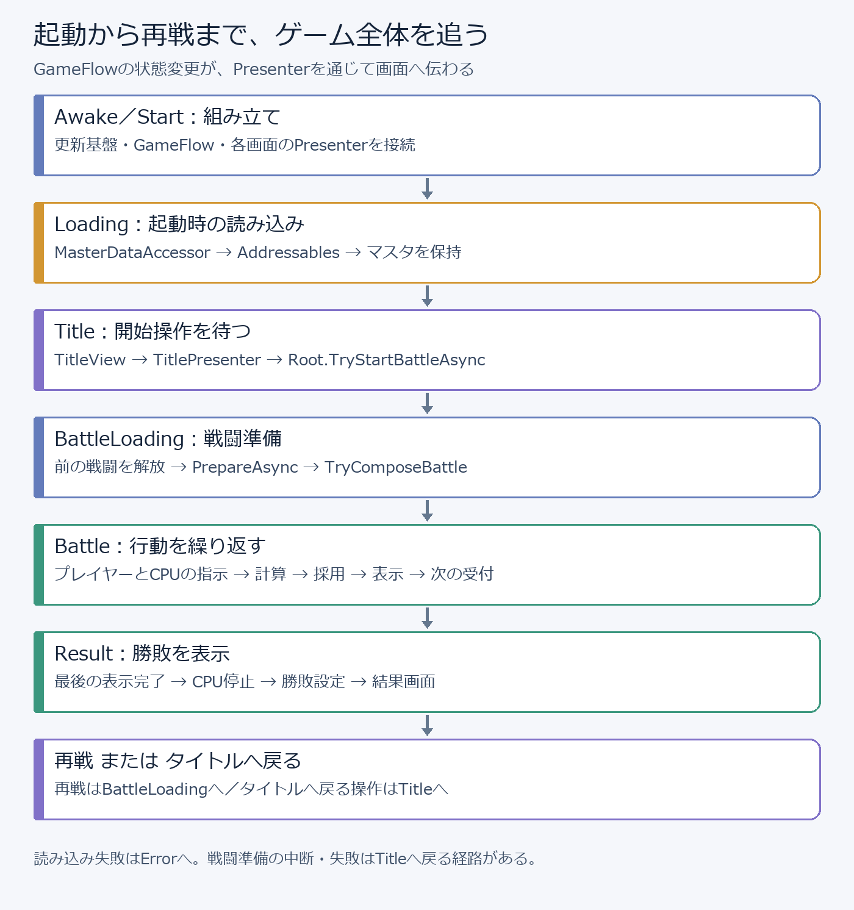
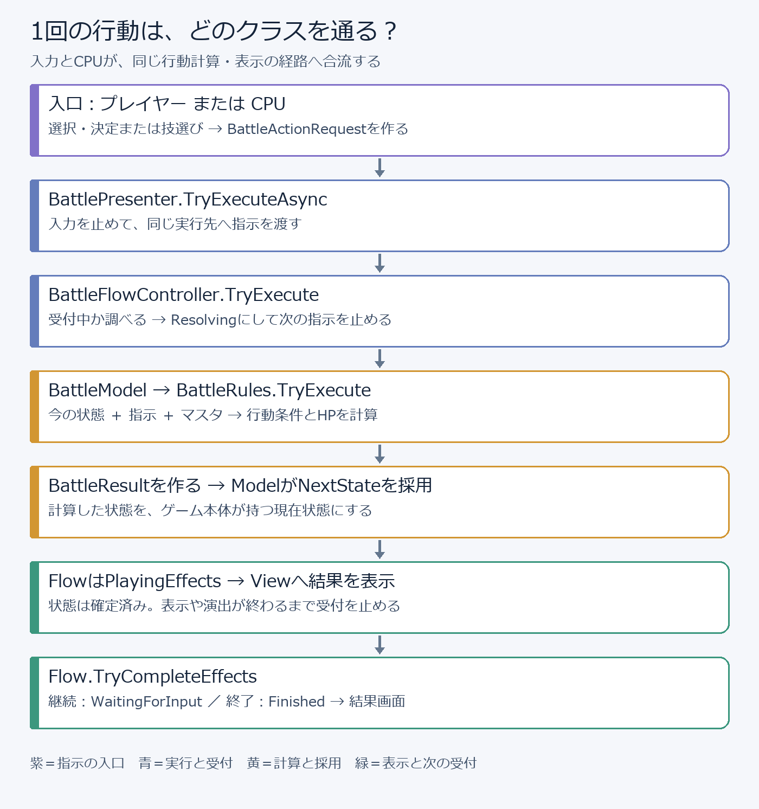
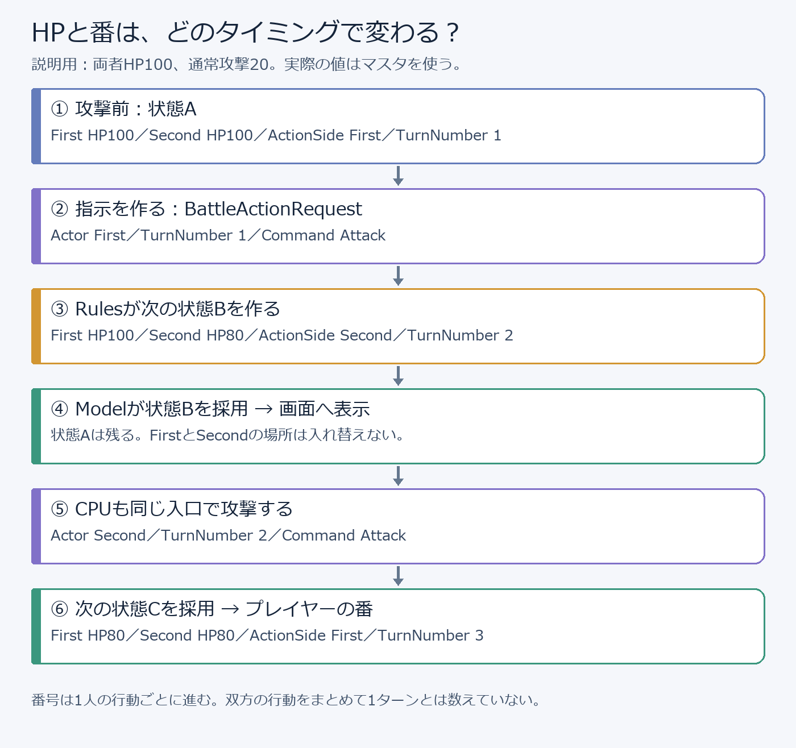
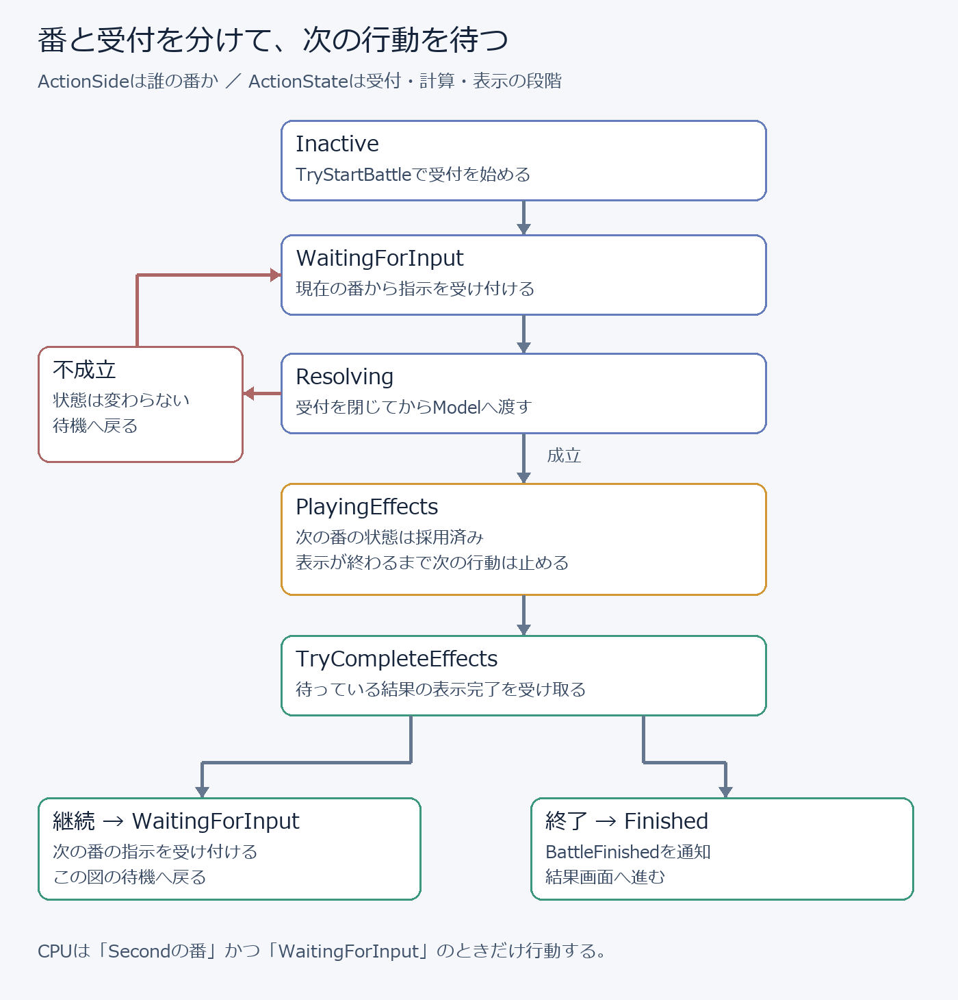

# TurnForge：プロジェクト全体のコードとターン進行

## この資料の読み方

TurnForgeの起動から、タイトル、戦闘準備、プレイヤーの操作、技の計算、表示、CPUの行動、勝敗、再戦までを順に説明します。「この関数がゲームのどの動きにつながるか」を知るための資料です。個別の授業や課題の説明ではありません。

対象は学生用プロジェクト `2026-Lesson-TurnForge` です。配布元には未実装の関数が残っています。この資料では、既に動く基盤、関数が受け持つ仕事、接続後のゲームの流れを区別して説明します。空の関数や常にfalseを返す関数が、そのまま図どおりに動くという意味ではありません。技の完成時の計算は、講師用TurnForgeの実装も参照しています。手元に追加した技やCPUがあれば、その部分は自分のコードと照らし合わせてください。

クラス名だけで迷ったら、次の3点を見ます。「何を受け取るか」「何を作る・覚える・知らせるか」「次に誰へ渡すか」です。

## 1．ゲーム全体を、役割で分ける

TurnForgeは、FirstとSecondが交互に技を使うターン制バトルです。現在のオフライン構成ではFirstがプレイヤー、SecondがCPUです。行動できる側が技を選び、成立した行動を計算し、その結果を表示してから次の行動を受け付けます。

- `Composition`：クラスを作り、必要な相手を渡してつなぐ。ゲームを組み立てる場所。
- `GameFlow`：起動、タイトル、戦闘準備、戦闘、結果の切り替え。
- `Battle`：両者の状態、行動の条件と計算、番の交代、CPUの技選び。
- `UI`：画面の表示、操作の通知、ゲーム本体との接続。
- `MasterData`：最大HPや技のダメージなど、設定されたデータの読み込み。
- `Infrastructure`：更新順、保存先など、複数の機能で使う土台。

### MVP：画面、本体、その橋渡し

MVPはModel・View・Presenterに役割を分ける考え方です。Modelは現在の戦闘状態を覚え、Rulesへ計算を頼みます。ViewはUnityのボタンや文字を扱います。PresenterはViewの通知を受け、実行先へ指示を渡し、戻ってきた結果をViewへ表示させます。

例えば攻撃ボタンの仕事は「Attackが選ばれた」と知らせることです。ボタンの中で相手HPを減らしません。HPの計算はRules、計算した状態の採用はModel、画面への反映はPresenterとViewが担当します。

`BattleFlowController` は行動を受け付ける段階を管理します。Modelに「今のHP」、Flowに「今は表示が終わるまで待つ」を持たせることで、表示中にCPUや連打が次の計算を始めることを防ぎます。

### MonoBehaviourと普通のC#クラス

View、GameCompositionRoot、GameLoopRunner、MasterDataAccessorなどはMonoBehaviourで、UnityのGameObjectに付けて使います。SerializeFieldの参照はInspectorで設定します。

Rules、Model、Presenter、Flow、CPUなどは普通のC#クラスです。Rootがnewで作ってつなぎます。Unityが自動でStartやUpdateを呼ぶ相手ではありません。CPUは更新基盤に登録されて初めてTickが呼ばれます。

## 2．起動から結果画面までの道筋



### Awake：更新する仕組みを用意する

`GameCompositionRoot.Awake` はGameLoopRunnerの参照を取得し、UpdateSchedulerを作ってRunnerへ渡します。Runnerが既に初期化されているなどの理由で失敗すれば、作成途中のものを片付け、Rootを無効にします。

Rootにはゲームをつなぐ責任がありますが、技のダメージ計算をここへ書くわけではありません。Rootが作ったRulesへ、その仕事を任せます。

### Start：画面と操作をつなぐ

- GameFlowControllerを作る。初期状態はInactive。
- GameScreenPresenterを作り、StateChangedを画面表示へ接続する。
- TitlePresenterへタイトル画面と戦闘開始関数を渡す。
- OfflineBattlePreparationとBattleLoadingControllerを作る。
- ResultPresenterへ結果画面、再戦関数、プレイヤー側Firstを渡す。
- UiSelectionControllerをSchedulerへ登録する。
- InitializeGameAsyncを開始する。

各PresenterのTryInitializeは必要な相手があるかを調べ、イベントへ関数を登録します。通知の登録を二重にしないよう、初期化済みかも覚えています。

### InitializeGameAsync：ゲームデータを読み込む

`TryBeginStartup` でInactiveからLoadingへ進みます。StateChangedを受けたGameScreenPresenterがローディング画面を表示します。RootはLoadMasterDataAsyncを待ち、成功ならTryCompleteStartupでTitle、失敗ならTryFailStartupでErrorへ進めます。待機中にRootが破棄されていたら、画面を進めず終了します。

### 画面切り替えは、状態変更から始まる

GameFlowController → StateChanged → GameScreenPresenter.HandleStateChanged → GameScreenViewのShowTitle／ShowBattle／ShowResultなど、という順です。GameScreenViewは指定されたパネルを有効にし、他のパネルを無効にします。この経路ではSceneManagerによる別シーンの読み込みではなく、参照された画面のGameObjectを切り替えています。

GameFlowControllerのTryTransitionは、現在の状態が期待した状態と一致する場合だけ切り替えます。StateChangedの通知中に別の状態変更が入ることも止めています。画面を直接切り替えるだけだと、本体のCurrentStateと画面が食い違うため、通常はGameFlowを通します。

## 3．マスタデータから、戦闘の初期状態を作る

### マスタは設定値、Stateは戦闘中の値

BattleCombatantDataRecordにはId、MaxHp、MaxEnergy、InitialEnergyがあります。BattleCommandDataRecordにはId、Command、Damage、EnergyCost、EnergyGain、GuardDamageDivisorがあります。Recordが1件分、ScriptableObjectのDataがRecordsの一覧を入れるアセットです。

最大HP100のマスタと、現在HP80のCombatantStateは別のデータです。攻撃でHPが減ってもマスタを書き換えません。同じマスタを使って新しい戦闘を始めれば、最大HPから初期状態を作れます。

### MasterDataAccessorの読み込み

- Registerで、アセット型・レコード型・Addressablesのラベルを登録する。登録した時点では読み込まない。
- InitializeAsyncが登録済みの読み込み関数を順に実行する。
- LoadAsyncがラベルに対応するアセットをAddressablesで読み込み、完了を待つ。
- 各アセットのRecordsをまとめ、IDをキーにしたDictionaryを作る。重複IDや空のデータは受け付けない。
- レコード型ごとにDictionaryを保持し、全て成功したらIsInitializedをtrueにする。

RootはBattleCombatantDataとBattleCommandDataを登録します。TryGetByIdは型とIDで1件取り出し、GetAllはその型の全件を返します。Registerは読み込み開始後に追加できません。InitializeAsyncを再度呼んだ場合は、進行中の読み込みを待ち、その結果を返します。

MasterDataAccessorはInstanceとして共有され、DontDestroyOnLoadで保持されます。破棄時には読み込みハンドルをAddressables.Releaseで解放します。これはアセットの使用を終える処理であり、戦闘中のHPを戻す処理ではありません。

### Factoryが両者を作る

BattleStateFactory.TryCreateInitialStateは、キャラクターのマスタ2件からCombatantStateを2つ作ります。HPはMaxHp、エネルギーはInitialEnergy、防御はfalseです。BattleStateはFirst先攻、TurnNumber 1、IsFinished falseで作ります。

MaxHpが正、エネルギーが0以上で最大値以下かなどを調べ、作れない場合はfalseを返します。両者が同じマスタIDでもStateは別に作るため、片方のHPが減っただけで両者のHPが減る構成にはなりません。

## 4．タイトルから戦闘を始める

TitleViewは開始ボタンのonClickをStartRequestedへつなぎます。TitlePresenterはタイトル表示中で、開始処理中ではないことを調べ、Rootから渡されたTryStartBattleAsyncを呼びます。開始中は入力を止め、二重に戦闘を作らないようにします。

### TryStartBattleAsyncの順序

- Rootが破棄済み、開始中、またはTitle／Result以外なら受け付けない。
- ReleaseBattleで前のCPU・Presenter・Modelなどを片付ける。
- BattleLoadingController.ReleasePreparatedResourcesで前の準備資源を解放する。
- TryPrepareAsyncでBattleLoadingへ進み、準備完了を待つ。
- TryComposeBattleで、今回の戦闘のクラスを作ってつなぐ。
- TryEnterBattleでGameStateをBattleへ進める。
- 戦闘画面へ切り替わってからCPUを有効にする。

### ローディングの役割

BattleLoadingControllerはIBattlePreparation.PrepareAsyncを待ちます。現在のOfflineBattlePreparationは約3秒の待機を行います。ここで通信接続や戦闘用アセットを実際に読み込んでいるわけではありません。マスタの実際の読み込みは起動時のLoadMasterDataAsyncにあります。

中断要求はCancellationTokenへ渡します。失敗・中断時には準備資源を解放し、可能ならTitleへ戻します。準備完了後にRootが戦闘を組み立てるため、「待ち時間が終わった」だけではBattleへ入りません。

### TryComposeBattleがつなぐ相手

- マスタから両者のレコードを取得し、Factoryで初期状態を作る。
- 技の全レコードをBattleRulesへ渡す。
- Rulesと初期状態をBattleModelへ渡す。
- ModelをBattleFlowControllerへ渡し、TryStartBattleで受付を始める。
- View・Model・Flow・操作する側FirstをBattlePresenterへ渡す。
- PresenterのBattleFinishedをRootの終了処理へ接続し、Presenterを初期化する。
- Selectorと、Presenter.TryExecuteAsyncという実行関数をCPUへ渡す。
- CPUをUpdateOrder.SimulationでSchedulerへ登録する。

Flowの受付開始 → Presenterの初期化 → 画面切り替え → CPU有効化、の順です。準備画面の裏でCPUが勝手に戦闘を進めないようにします。

## 5．戦闘中に扱う「状態」「指示」「結果」

### CombatantState：1人分の状態

- Side：FirstまたはSecond。
- Hp／MaxHp：現在HPと最大HP。
- Energy／MaxEnergy：現在のエネルギーと上限。
- IsGuarding：防御中か。
- IsDefeated：HPから倒れたかを判断するプロパティ。

### BattleState：戦闘全体の状態

- FirstCombatant／SecondCombatant：両者の状態。番が変わっても場所は交換しない。
- ActionSide：今、行動する側。
- TurnNumber：現在の行動番号。
- IsFinished：戦闘が終わったか。

FirstとSecondは立場を識別する名前です。先攻・後攻の順を毎回並べ直す配列ではありません。actorは今回行動する側、targetはその相手です。CPUの番ならactorがSecond、targetがFirstになります。

### BattleActionRequest：行動の指示

Actor、TurnNumber、Commandを渡します。「誰が」「どの番号で」「どの技を使うか」です。「相手HPを80にする」のような計算済みの値は入れません。

```csharp
// 指示を作るだけでは、まだ戦闘は進まない。
var request = new BattleActionRequest(
    BattleSide.First,
    model.CurrentState.TurnNumber,
    BattleCommand.Attack);
```

BattleCommandはAttack・Guard・Charge・Specialの種類を表すenumです。種類名を追加するだけで技が動くわけではありません。条件、計算、画面、結果文などの対応も必要です。

### BattleResult：成立した指示と、変更前後の状態

Requestは実行した指示、PreviousStateは実行前、NextStateは実行後です。計算結果を1つにまとめ、Model・表示・Flowで同じ結果を使います。前後のHPを比べれば、表示用に「いくつ減ったか」も分かります。

### HPが変わるのに、Stateがget／initなのはなぜ？

Stateは作成後にHPを直接代入する形ではありません。変更後のCombatantStateとBattleStateを新しく作り、Modelが現在状態として持つ参照を差し替えます。ゲーム中のHPは変わりますが、状態Aの中身を変更するのではなく、状態Aから状態Bへ進みます。

この方式は変更前の状態を結果文や演出に使いやすくします。RulesがnewしただけではModelのCurrentStateは変わりません。ModelのTryExecuteで、Rulesの成功後にNextStateを採用する処理が必要です。

```csharp
// Modelが結果を採用する部分の例。Rulesの成功後に行う。
_currentState = result.NextState;
ActionResolved?.Invoke(result);
```

通知は採用後です。現在のBattlePresenterはこのActionResolvedを購読して画面更新する構成ではなく、TryExecuteAsyncが受け取った結果をViewへ渡します。

## 6．パッド・キーボード・クリックから、共通の指示へ

### フォーカスと、選んだ技は別

EventSystemが持つ「現在選択中のボタン」はUIのフォーカスです。矢印キーやパッドで移動する位置を指します。Presenterの_selectedCommandは「実際に使うために選んだ技」です。フォーカスがAttackにあるだけで、攻撃が確定するわけではありません。

Input SystemのUI入力、EventSystem、ButtonのSubmitまたはクリックを通じてonClickへ合流させると、操作機器が違っても同じViewの通知を使えます。完成版は既存のUI入力を使う構成です。操作方式を選ぶ設定画面や、選んだ機器以外を無効にする専用クラスは実装されていません。この解説と第2回の課題では、それらを追加しません。

### 選択 → 決定 → 実行

- 技ボタンのonClick → HandleAttackなど → NotifySelection(command)。
- ViewのCommandSelected通知 → Presenter.HandleCommandSelected。
- Presenterが選んだ技を覚え、View.SetSelectedCommandへ渡す。
- 決定ボタン → ViewのConfirmRequested → Presenter.HandleConfirmRequested。
- Presenterが現在の番号・操作する側・選んだ技からRequestを作り、TryExecuteAsyncへ渡す。

これは入力接続を完成させた場合の経路です。配布元のNotifySelection、HandleConfirm、HandleCancel、OnCancel、Presenterの各入力ハンドラには空の処理が残っています。現在のCanAcceptPlayerInputはfalse、RefreshInputは入力を無効にする実装です。

### 取消とボタンの有効条件

取消は選んだ技をnullへ戻します。成立した行動のHPを巻き戻す操作ではありません。戦闘本体へ指示を送る前の選択を取り消します。

BattleView.RefreshButtonsは、入力受付の可否と_availableCommandsの両方を見て技ボタンを有効にします。決定は技が選ばれていて使用可能なとき、取消は技が選ばれているときに有効になります。完成させるPresenterのRefreshInputがModel.CanExecuteなどから使用可能な技を判断し、Viewへ渡す役割です。

UiSelectionControllerは操作可能なボタンへフォーカスを補います。UiButtonはButtonを継承し、Cancelを親へ伝えます。UiButton.Resetの選択色・Automatic NavigationはEditorで初期設定する処理で、戦闘の計算ではありません。

入力を切っても、CPUは同じ実行関数を呼べます。RootのExecuteLessonAttackもRequestを作って直接Presenterへ渡す補助入口であり、ボタンの通知を経由しません。

## 7．1回の行動が通る、共通の実行経路



### ① Presenterが実行の入口を守る

TryExecuteAsyncは破棄済み、未初期化、実行中、受付時間外ならfalseを返します。開始できれば_isExecutingをtrueにし、View.SetInputEnabled(false)で画面の操作を止めます。非同期の表示待ちがあるため、待っている間も新しい実行を開始しないようにします。

### ② Flowが受付を閉じてからModelへ渡す

Flow.TryExecuteはWaitingForInputのときだけ進みます。先にActionStateをResolvingへ変更し、その後でModel.TryExecuteを呼びます。Modelが成立しなかった場合はWaitingForInputへ戻し、結果を返しません。

### ③ Modelが現在状態と指示をRulesへ渡す

Modelの役割は、現在のBattleStateを持つことと、Rulesが返したNextStateを採用することです。Rulesへ現在状態とRequestを渡し、falseなら採用しません。trueならCurrentStateを差し替え、ActionResolvedを知らせます。配布元のTryExecuteは現在未実装です。

### ④ Rulesが次の状態とBattleResultを作る

Rulesはマスタ、現在状態、指示から使用条件と値を計算します。画面文字を直接変えたり、CPUだけ別のHP計算をしたりしません。成功時にはRequest・PreviousState・NextStateをまとめたBattleResultを返します。配布元の行動計算は未実装で、次章でその役割と完成時の処理を説明します。

### ⑤ Flowが「表示待ち」を覚える

Modelが成功した結果を_pendingResultとして覚え、ActionStateをPlayingEffectsへ進めます。この時点でModelの状態は次の番へ進んでいますが、次の行動の受付はまだ閉じています。

### ⑥ Presenterが結果文と表示をViewへ渡す

選択中の技を解除し、BattleResultFormatter.Formatで結果文を作ります。View.PlayResultAsync(result, message, token)をawaitします。現在のViewはNextStateと結果文を即時表示し、UniTask.CompletedTaskを返します。長いアニメーションを待つ実装ではありません。

### ⑦ 表示完了後に次の行動を開く

Presenterは現在状態をRenderし、Flow.TryCompleteEffects(result)を呼びます。FlowはPlayingEffects中か、同じ_pendingResultの完了かを調べ、継続ならWaitingForInput、決着ならFinishedへ進めます。その後Presenterが入力の有効状態を更新します。

FinishedならPresenter.BattleFinishedを通知します。RootはCPUを止め、ResultPresenterへ勝敗を設定し、GameFlowをResultへ進めます。

### どこで何が止まるか

Presenterは実行の重複、Flowは受付時間外、Rulesは不正な番・番号・技などを止めます。ボタンが無効なだけでは内部のRulesが安全とは限りません。CPUや補助入口からの指示も共通経路を通し、本体側でも条件を調べます。

## 8．技の条件、値の計算、番の交代

以下は完成時のBattleRulesが担う処理です。配布元のCanExecute、TryExecute、ApplyDamage、CopyCombatantには未実装部分があります。手元のコードの実装範囲と区別して読んでください。

### マスタを受け取るコンストラクタ

技のレコードをBattleCommandをキーにしたDictionaryへ入れます。Commandの種類、負のDamage／EnergyCost／EnergyGain、1未満のGuardDamageDivisor、重複する技などを調べます。全ての技がそろえばIsConfiguredをtrueにします。

この処理は技の設定を使える形にする準備です。CanExecuteは「この場面で、この人が、この技を使えるか」の判断で、役割が違います。

### CanExecuteが調べる条件

- マスタの準備ができ、StateとRequestがある。
- 戦闘が終わっておらず、番号が1以上。
- 両者のSide・HP・エネルギーが有効な範囲。
- ActionSideがFirstかSecondで、Request.Actorと一致する。
- Request.TurnNumberが現在の番号と一致する。
- 技のマスタが存在し、必要なエネルギーが足りる。
- 行動する側が防御状態を持ち越していない。
- Chargeなら、既にエネルギー上限ではない。

公開CanExecuteは使用可否だけを返し、private版は計算で使うcommandDataもoutで返す形です。Model.CanExecuteは現在番号のRequestを組み立て、この判断をUIの使用可能表示にも使えるようにします。

### actorとtargetを取り出す

GetCombatantはSideに対応するCombatantStateを取得します。GetOpponentSideは反対側を返します。Firstが攻撃してもSecondが攻撃しても、以降はactorとtargetという同じ書き方で計算できます。

### エネルギーと防御状態

完成時の次エネルギーは「現在Energy − EnergyCost ＋ EnergyGain」をMaxEnergyまでに収めます。加算時の大きい数の扱いにはlongを使い、上限を適用してからintへ戻します。コスト不足は計算前に拒否します。

次のactorは、Hpと最大値を引き継ぎ、Energyを計算値にし、選んだ技がGuardならIsGuardingをtrueにして作ります。CopyCombatantはSide・最大値を引き継ぎ、変更するHp・Energy・IsGuardingを受け取って新しい状態を作る役割です。

### 4種類の技

- Attack：相手へDamageを適用する。
- Guard：自分を防御状態にする。この行動では相手HPを減らさない。
- Charge：マスタのEnergyGainなどを使って自分のエネルギーを変える。この行動では相手HPを減らさない。
- Special：マスタのEnergyCostを消費し、相手へDamageを適用する。

具体的なダメージやコストをコードへ固定しません。攻撃と必殺技は、技ごとのマスタ値を同じダメージ処理へ渡します。

### ApplyDamageと防御の期限

相手が防御中なら、通常のDamageを防御技マスタのGuardDamageDivisorで割ります。整数の割り算なので小数部分は切り捨てです。次HPは0未満にならないようにし、エネルギーなどは引き継ぎます。

例えばDamage21、除数2なら実ダメージ10です。相手HP8なら次HP0、結果文に表示するHP減少は8です。マスタのDamageそのものと実際に減ったHPは一致しない場合があります。

GuardでFirstが防御 → Secondが攻撃するときに軽減 → Firstへ番が戻るときに防御解除、という順です。完成時のRulesは次に行動する側の防御を解除します。防御は無期限に残る効果ではありません。

### 決着と次の番

相手が倒れたらIsFinishedをtrueにします。戦闘が続く場合だけ、ActionSideを相手へ変え、TurnNumberを1増やします。終了した行動では、その行動の側と番号を維持します。番号がint.MaxValueなら加算できないため、その行動を成立させません。

最後にnextActorとnextTargetをFirstCombatant／SecondCombatantの正しい場所へ戻し、新しいBattleStateを作ります。現在状態を途中で書き換えないので、条件に合わずfalseを返した場合はModelが元の状態を保持できます。

## 9．数字で追う、プレイヤーとCPUの1往復

数値は説明用です。実際にはマスタの値を使います。技の処理とModelの採用を実装した場合の例です。



### プレイヤーの通常攻撃

- 開始状態：First HP100、Second HP100、ActionSide First、TurnNumber 1。
- 指示：Actor First、TurnNumber 1、Command Attack。
- 条件が一致すればRulesが相手HP100から20を引く。
- 次状態：First HP100、Second HP80、ActionSide Second、TurnNumber 2。
- Modelが次状態を採用する。FlowはPlayingEffectsで、次の指示はまだ受け付けない。
- 表示完了を受け取ってFlowがWaitingForInputへ戻る。

### CPUの通常攻撃

- CPUが「Secondの番」と「WaitingForInput」を調べる。
- SelectorがAttackを選び、Actor Second、TurnNumber 2で指示を作る。
- 同じPresenter → Flow → Model → Rulesへ渡す。
- 次状態：First HP80、Second HP80、ActionSide First、TurnNumber 3。
- 表示を終え、プレイヤーが次の技を選べる状態へ戻る。

TurnNumberは1人の成立した行動ごとに進みます。プレイヤーとCPUの1往復をまとめて1増やす数え方ではありません。結果画面の番号も、この数え方の値です。

相手HP10への攻撃20なら次HP0で決着し、次の番へ交代しません。Firstの番にSecondの指示、番号2に番号1の指示、終了後の指示は不成立です。不成立でHP・番・番号が進むことはありません。

## 10．「誰の番」「受付の段階」「ゲームの画面」を分ける



- BattleState.ActionSide：FirstかSecondか。誰が行動するか。
- BattleFlowController.ActionState：Inactive・WaitingForInput・Resolving・PlayingEffects・Finished。行動の処理段階。
- GameFlowController.CurrentState：Inactive・Loading・Title・BattleLoading・Battle・Result・Error。ゲーム全体の段階。

例えば「GameStateはBattle、ActionSideはSecond、ActionStateはPlayingEffects」なら、戦闘画面で、次はCPUの番ですが、表示中なのでCPUはまだ行動しません。

InactiveからTryStartBattleで受付を始めます。指示が来るとWaitingForInputからResolvingへ進み、成立ならPlayingEffects、不成立ならWaitingForInputへ戻ります。表示が終わると、継続はWaitingForInput、決着はFinishedです。

TryCompleteEffectsは現在の_pendingResultとReferenceEqualsで同じ結果かを調べます。前の行動の完了を、今の行動の完了として扱わないためです。値が似ている別のBattleResultでも、この完了通知には使えません。

## 11．CPUの行動と、毎フレームの更新

### 更新経路

UnityのUpdate → GameLoopRunner.Update → UpdateScheduler.RunUpdate → 登録されたBattleCpuController.Tick、の順です。CPUのTickはHPを減らす処理ではなく、指示を出すタイミングを調べる処理です。

- 破棄済み、無効、または実行中なら何もしない。
- Model・Flow・Selector・実行関数とCPUのSideを調べる。
- Stateがある、戦闘が続いている、受付中、自分の番という条件を調べる。
- Selector.TrySelectCommandで技を選ぶ。
- 現在番号のBattleActionRequestを作る。
- _isExecutingをtrueにして、渡された実行関数を呼ぶ。
- 完了後に実行中を解除する。失敗ならCPUを止め、Failedで知らせる。

Rootが渡す関数はBattlePresenter.TryExecuteAsyncです。プレイヤーとCPUは技の選び方が違いますが、行動の計算と表示の流れを共有します。AttackOnlyCommandSelectorは通常攻撃を選ぶためのクラスで、配布元の選択関数は未実装です。自作Selectorへ差し替えても、ダメージ計算はRulesに残します。

現在のPlayResultAsyncは即時完了のため、プレイヤーの攻撃直後にCPUの行動まで進んで見えることがあります。Modelの採用とCPUの開始の間に、長い演出時間が必ず入るわけではありません。

### UpdateSchedulerの順序

Input 100、Simulation 200、Effects 300、Presentation 400、Camera 500がUpdateOrderの基準です。小さいOrderから呼び、同じOrderなら登録順です。RootはUiSelectionControllerをInput、CPUをSimulationに登録しています。

SchedulerはUpdate・FixedUpdate・LateUpdateに別々のリストを持ちます。IUpdateTickableはTick、IFixedTickableとILateTickableは対応する更新関数の窓口です。GameLoopRunnerは各Unityイベントに合わせた経過時間をUpdateContextで渡します。FixedUpdateのたびにターン番号を増やすわけではありません。

登録時に返るIDisposableは登録解除用のハンドルです。Disposeすると対象を無効にします。処理中は配列の位置を急に詰めず、呼び出しが終わってから不要な項目を取り除きます。途中で新規登録された相手は、その回の開始時の件数に含まれないため次回以降に呼びます。

try／finallyは、登録先の処理で例外が起きても「実行中」の旗や後片付けを戻すためにあります。例外を握りつぶすcatchではありません。Schedulerは自分へ登録した対象だけを並べます。全MonoBehaviourやEventSystemまで同じ順序で管理する仕組みではありません。

## 12．結果の表示、勝敗、再戦、終了

### 結果文は、前後の状態から作る

BattleResultFormatterは、操作する側を基準に「あなた／相手」を決め、技名とHP・エネルギーの変化を文章にします。相手のPreviousState.Hp − NextState.Hpを使うため、防御軽減やHP0の下限を反映した文になります。ここでダメージを再計算してStateへ代入することはありません。

BattleView.RenderはHP・エネルギー・防御・番をTextMeshProへ表示します。SetSelectedCommandは技の選択文、PlayResultAsyncは結果文と行動結果の表示を担当します。数字を画面へ出す仕事と数字を決める仕事を分けます。

### 最後の表示が終わってから結果画面へ

PresenterのBattleFinished → Root.HandleBattleFinised → CPU.SetEnabled(false) → ResultPresenter.TrySetResult → GameFlow.TryShowResult → Result画面、の順です。メソッド名HandleBattleFinisedは現在のコードの綴りです。

ResultPresenterは操作する側をプレイヤーとして、プレイヤーだけ倒れれば敗北、相手だけ倒れれば勝利、両者が倒れていれば引き分けを表示します。両者とも倒れていない状態は結果として受け付けません。勝敗文と行動番号を設定してから画面を切り替えます。

### 再戦とタイトルへ戻る

ResultViewはRetryRequestedとReturnToTitleRequestedを知らせます。再戦はResultPresenterからRootのTryStartBattleAsyncへ戻り、前の戦闘を片付け、準備画面を経由し、新しい初期状態を作ります。前のModelのHPを直接最大値へ書き換える形ではありません。

タイトルへ戻る操作はGameFlow.TryReturnToTitleで画面を戻します。この操作だけではRoot.ReleaseBattleは呼ばれません。CPUは勝敗確定時に既に止まっており、前の戦闘の参照は次の戦闘開始またはRootの終了時に片付けます。

### ReleaseBattleとRelease

ReleaseBattleはCPUの更新登録を解除し、CPUの通知を解除・破棄し、画面入力を止め、Presenterの通知と表示待ちを片付け、FlowとModelの参照を外します。新しい戦闘を作る前に、古いCPUが動かない状態にします。

Root全体のReleaseは破棄済みの旗を立て、所有するRunnerを停止し、UI更新登録、戦闘、準備処理、画面Presenter、Schedulerを順に片付けます。OnDestroyからも呼びます。Presenter.Disposeはイベント購読を解除し、CancellationTokenSourceで待機の中断を知らせます。

## 13．保存と、これから接続する機能の位置

### 保存の役割分担

- BattleRecordSaveData：Version・WinCount・LossCount・DrawCountをまとめた戦績データ。
- BattleRecordService：戦績を読み、勝敗を一度だけ加え、変更があるとき保存する担当。
- ISaveStorage：保存と読み込みの共通窓口。
- JsonFileSaveStorage：保存先ディレクトリとキーを使い、JSONファイルを扱う担当。
- SaveLoadStatus：Failed・NotFound・Successを区別する。

配布元のServiceとStorageの保存・読み込み・加算は未実装です。Rootの起動時読み込み、結果時加算、終了前保存も接続されていません。起動時はマスタを読み、保存処理を呼ばずタイトルへ進みます。

戦績データに戦闘中のHPはありません。途中再開には両者の状態、番、番号、キャラクターIDなどを持つ別データと復元処理が必要です。Stateを保存データへ移す場合も、マスタの固定値と現在値を区別します。

### R3・VContainer・オンライン・演出

現在はC#／UnityActionのイベントと、Rootによる手動のnewで接続されています。R3による通知、VContainerによる組み立て、オンラインの接続と指示送受信は未実装です。既に動く機能として読む必要はありません。

VContainerへ移す場合はRootが担当する組み立てと寿命管理が入口になります。R3へ移す場合は状態変更や操作通知の受け渡しが入口になります。オンライン準備はIBattlePreparation、行動指示はBattleActionRequest、確定結果はModelへの反映と表示の経路が関係します。これらは追加先の説明で、現在の配布コードに通信が存在するという意味ではありません。

演出を追加する入口はView.PlayResultAsyncです。表示完了を待つ仕組みがあるため、Rulesの計算と分けて追加できます。現状の表示は即時完了です。

## 14．コード表現を、ゲームの動きにつなげる

- コンストラクタの引数：そのクラスが仕事をするために使う相手を受け取る。
- readonlyの参照：受け取った相手を別の相手へ差し替えない。その相手の内部が全て不変になる意味ではない。
- get／init：状態を作るときに値を入れ、作成後は通常の代入で変更しない。
- Try～のbool：処理が成立したか。勝利・敗北の意味ではない。
- out result：成立した結果も呼び出し側へ返す。falseなら結果を使わない。
- return：条件に合わなければ、その関数をそこで終える。
- BattleCommand?：技の選択値、または未選択のnullを持つ。
- eventと+=：通知の受け取り先を登録する。登録だけでは攻撃は起きない。
- -=：通知の受け取りを解除する。再戦時の二重呼び出しを防ぐ。
- ?.Invoke：受け取り先があるときに知らせる。
- Func<BattleActionRequest, UniTask<bool>>：Requestを受けて非同期の成否を返す関数を、CPUへ渡すための型。
- await：処理の完了後に続きを進める。Unity全体を停止して待つわけではない。
- Forget()：イベントやTickから非同期処理を開始する。全ての例外を無視する指示ではない。
- CancellationToken：画面や戦闘を終了したとき、待機する相手へ中断を知らせる。
- IDisposable／Dispose：イベントや更新登録など、自分が使っていたものを片付ける。
- Interface：相手へ求める関数や通知の約束。IBattleViewなら表示と操作通知、IBattleCommandSelectorなら技選びの約束。

## 15．動きから、読む場所を探す

- タイトルが出るまで：Root.InitializeGameAsync → LoadMasterDataAsync → GameFlow → GameScreenPresenter。
- 戦闘が始まるまで：TitlePresenter → Root.TryStartBattleAsync → BattleLoadingController → TryComposeBattle → Factory。
- ボタンが押せない：Viewの入力フラグ・使用可能な技 → Presenter.RefreshInput → Model.CanExecute → Rules.CanExecute。
- 技を選んだだけで攻撃しない：選択と決定を分けた経路 → Requestの作成 → Presenter.TryExecuteAsync。
- HPが変わらない：Rulesの結果 → ModelのNextState採用 → ViewへのRender。
- CPUが動かない：更新登録 → IsEnabled → ActionSide → Flow.CanAcceptInput → Selector → 共通実行関数。
- 画面の番はCPUなのにCPUが待つ：Flow.ActionStateがPlayingEffectsか、表示完了が戻っているか。
- 結果画面へ進まない：IsFinished → TryCompleteEffects → BattleFinished → Root → GameFlow.TryShowResult。
- 再戦で前のCPUが残る：ReleaseBattleの登録解除・Dispose → 新しいCPUの登録。

関数が呼ばれたか、falseで止まったか、次の状態を採用したか、画面へ渡ったかを順に追います。画面の見た目だけでは、どの段階で止まったかは分かりません。

## 16．ファイル一覧：プロジェクト内の場所と役割

以下の一覧は、特記しない限りAssets/TurnForge/Scriptsからのパスです。Battle・UIの小見出しでは、そのフォルダの中の相対パスを示しています。各ファイルを役割から探すために使ってください。

### Battle：戦闘の状態と計算

- `Models/CombatantState.cs`：1人のHP・エネルギー・防御。
- `Models/BattleState.cs`：両者の状態・番・番号・終了。
- `Models/BattleSide.cs`：FirstとSecondの区別。
- `Models/BattleResult.cs`：成立した指示と、変更前後の状態。
- `Models/BattleActionState.cs`：受付・計算・表示・終了の段階名。
- `Commands/BattleCommand.cs`：Attack・Guard・Charge・Specialなど技の種類。enum追加だけでは技は動かない。
- `Commands/BattleActionRequest.cs`：誰が・どの番号で・何をするか。
- `Rules/BattleRules.cs`：技のマスタを保持し、条件と次の状態を計算。
- `BattleModel.cs`：現在状態を持ち、成立した結果を採用。
- `Factories/BattleStateFactory.cs`：キャラクターマスタから、HP最大・First先攻・番号1の初期状態を作る。
- `Flow/BattleFlowController.cs`：次の指示を受け付ける時期と表示完了を管理。
- `AI/IBattleCommandSelector.cs`：CPUの技の選び方に求める関数。
- `AI/AttackOnlyCommandSelector.cs`：自分の番で通常攻撃を選ぶ。
- `AI/BattleCpuController.cs`：番と受付を見てSelectorを呼び、共通の実行先へ送る。
- `Preparation/IBattlePreparation.cs`：戦闘前の準備と解放の窓口。
- `Preparation/OfflineBattlePreparation.cs`：現在は約3秒待って戦闘へ進む。通信処理ではない。
- `MasterData/BattleCombatantData.cs`：キャラクターの固定値のレコードと、それをまとめるアセット。
- `MasterData/BattleCommandData.cs`：ダメージ・コストなど技の固定値のレコードとアセット。
- `Saving/BattleRecordSaveData.cs`：勝敗数など保存向けのデータ。戦闘途中のHPを保存するデータとは別。
- `Saving/BattleRecordService.cs`：戦績の読み込み・加算・保存の担当。保存関連は未実装。

### UI：操作の通知と表示

- `Battle/IBattleView.cs`：操作イベントと表示関数の窓口。
- `Battle/BattleView.cs`：ボタンの通知、HP・番・結果文の表示。
- `Battle/BattlePresenter.cs`：選択・決定・取消、共通の行動実行と表示待ちを接続。
- `Battle/BattleResultFormatter.cs`：前後のHPなどから結果文を作る。ダメージ計算をするRulesとは別。
- `Title/ITitleView.cs`・`TitleView.cs`・`TitlePresenter.cs`：タイトルの開始ボタン、その通知、戦闘開始の接続。
- `Result/IResultView.cs`・`ResultView.cs`・`ResultPresenter.cs`：勝敗表示、再戦・タイトルへ戻る操作の接続。
- `GameFlow/IGameScreenView.cs`・`GameScreenView.cs`・`GameScreenPresenter.cs`：ゲーム全体の状態に応じたパネル切り替え。
- `Common/UiButton.cs`：Buttonを拡張し、取消イベントを親へ渡す。
- `Common/UiSelectionController.cs`：有効なボタンへフォーカスを補う。選択中の技を決める処理とは別。
- `TurnForgeUI.cs`：現在は空のStart／Updateのみ。戦闘処理を集約した本体ではない。

### GameFlowとComposition：ゲームを始める準備

- `GameFlow/GameState.cs`：Loading・Title・BattleLoading・Battle・Resultなど全体の段階。
- `GameFlow/GameFlowController.cs`：全体の状態を切り替え、StateChangedで知らせる。
- `GameFlow/BattleLoadingController.cs`：準備中の表示・待機・中断・戦闘への移行。
- `Composition/GameCompositionRoot.cs`：Viewなどの参照を受け、Rules・Model・Presenter・CPUを作って接続。終了時には解除する。直接指示を送る補助入口もある。

起動ではRootが更新基盤を用意し、マスタを読み、タイトルへ進めます。開始操作で前の戦闘を片付け、BattleLoadingを経由し、Factoryで初期状態を作ります。Flowを開始してPresenterを初期化し、CPUを更新に登録してから戦闘画面へ進み、CPUを有効にします。

### MasterData：ゲームの固定値を読む

- `MasterDataAccessor.cs`：マスタを登録・Addressablesで読み込み、型やIDからレコードを取り出す。
- `IMasterData.cs`：マスタの1レコードが持つ共通の窓口。
- `IMasterDataContainer.cs`：複数レコードを持つアセットの共通の窓口。
- `Assets/Editor/MasterData/MasterDataImporter.cs`：Editorで元データからマスタを作るための道具。ゲームの攻撃中に使う関数ではない。

マスタのMaxHpやDamageは設定値です。戦闘中の減ったHPはCombatantStateにあり、攻撃のたびにマスタのHPを書き換えません。

### Infrastructure：毎フレームの呼び出しと保存の土台

- `Updating/GameLoopRunner.cs`：UnityのUpdate・FixedUpdate・LateUpdateをSchedulerへ渡す。
- `Updating/UpdateScheduler.cs`：登録対象を順序付きで呼び、解除用のハンドルを返す。
- `Updating/UpdateOrder.cs`：Input 100、Simulation 200、Effects 300、Presentation 400、Camera 500という順序の基準。
- `Updating/UpdateContext.cs`：その更新で使う経過時間。
- `Updating/IUpdateTickable.cs`・`IFixedTickable.cs`・`ILateTickable.cs`：各更新で呼ぶ関数の窓口。
- `Saving/ISaveStorage.cs`：保存・読み込みの共通窓口。
- `Saving/JsonFileSaveStorage.cs`：JSONファイルの保存・読み込みを作る場所。保存関連は未実装。
- `Saving/SaveLoadStatus.cs`：読み込み結果の種類。
- `LangCompat/IsExternalInit.cs`：initを使うための型定義。攻撃中に動くゲーム処理ではない。


